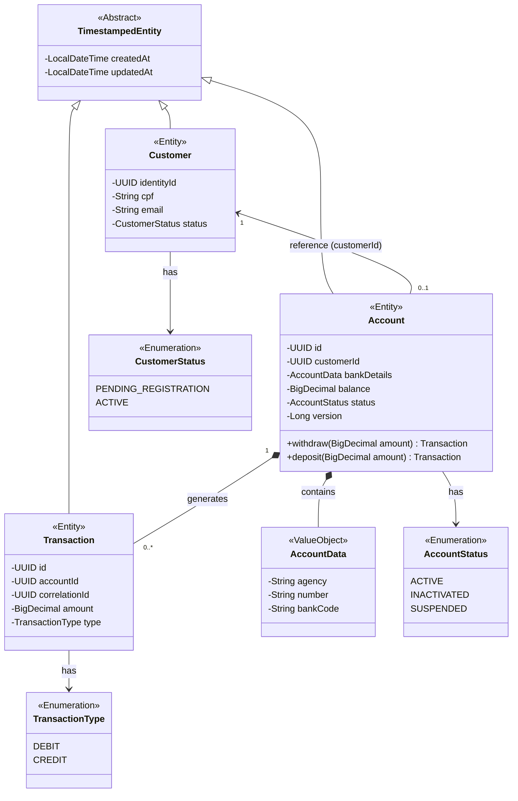

```mermaid
classDiagram
    direction TB

    class TimestampedEntity {
        <<Abstract>>
        -LocalDateTime createdAt
        -LocalDateTime updatedAt
    }

    TimestampedEntity <|-- Customer
    TimestampedEntity <|-- Account
    TimestampedEntity <|-- Transaction

    class Customer {
        <<Entity>>
        -UUID identityId
        -String cpf
        -String email
        -CustomerStatus status
    }

    class Account {
        <<Entity>>
        -UUID id
        -UUID customerId
        -AccountData bankDetails
        -BigDecimal balance
        -AccountStatus status
        -Long version
        +withdraw(BigDecimal amount) Transaction
        +deposit(BigDecimal amount) Transaction
    }

    class AccountData {
        <<ValueObject>>
        -String agency
        -String number
        -String bankCode
    }

    class Transaction {
        <<Entity>>
        -UUID id
        -UUID accountId
        -UUID correlationId
        -BigDecimal amount
        -TransactionType type
    }

    class CustomerStatus {
        <<Enumeration>>
        PENDING_REGISTRATION
        ACTIVE
    }

    class AccountStatus {
        <<Enumeration>>
        ACTIVE
        INACTIVATED
        SUSPENDED
    }

    class TransactionType {
        <<Enumeration>>
        DEBIT
        CREDIT
    }

    Customer "1" <-- "0..1" Account : reference (customerId)
    Account "1" *-- "0..*" Transaction : generates

    Account *-- AccountData : contains
    Customer --> CustomerStatus : has
    Account --> AccountStatus : has
    Transaction --> TransactionType : has
```