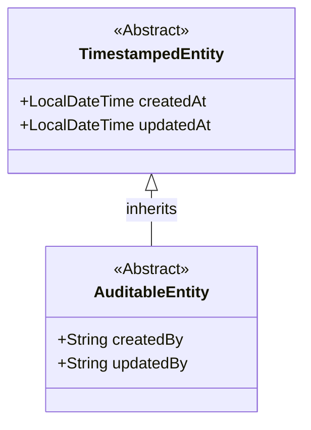

# Domínio: Agora Common

Este serviço atua como uma biblioteca com ferramentas universais entre os serviços.

## Diagrama de Classes

```mermaid
classDiagram
    direction TB
    
    class TimestampedEntity {
        <<Abstract>>
        +LocalDateTime createdAt
        +LocalDateTime updatedAt
    }
    
    class AuditableEntity {
        <<Abstract>>
        +String createdBy
        +String updatedBy
    }

    TimestampedEntity <|-- AuditableEntity : inherits
```