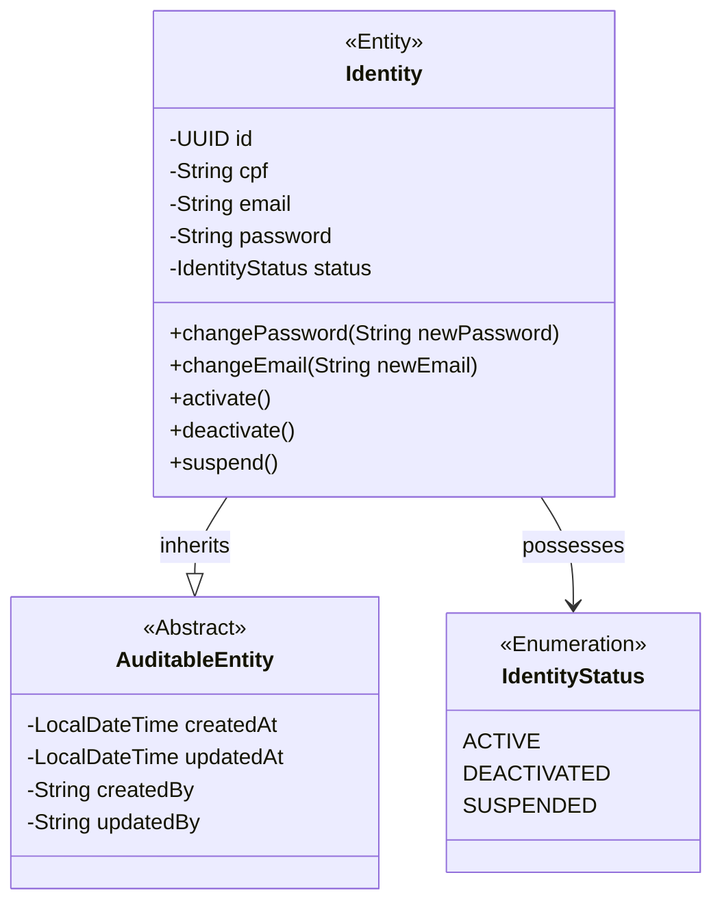

# Domínio: Agora Identity

Este serviço atua como o Provedor de Identidade (IdP) e Single Sign-On (SSO) de todo o ecossistema.  
Ele é o único sistema que conhece as credenciais de acesso do cliente.

## Diagrama de Classes

