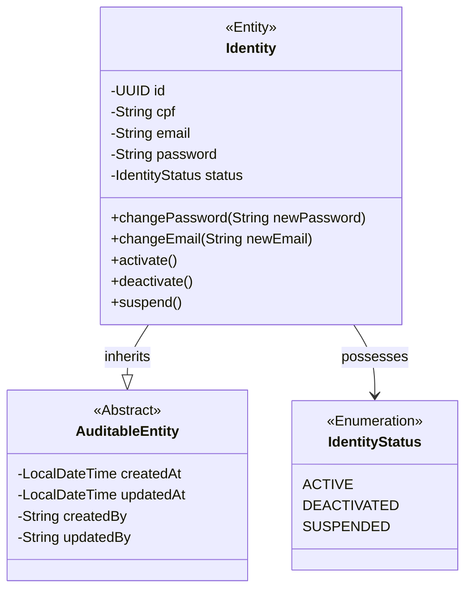
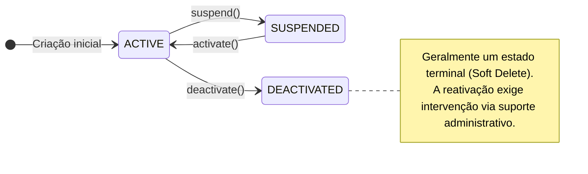
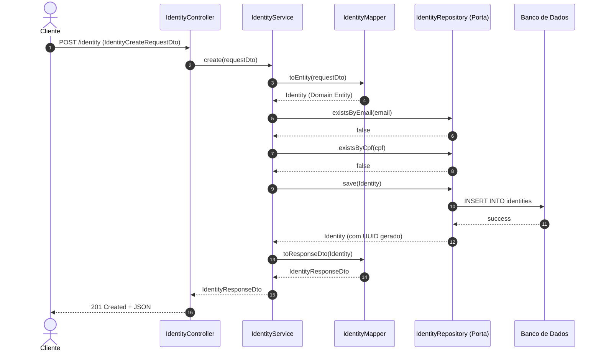

# Domínio: Agora Identity

Este serviço atua como o Provedor de Identidade (IdP) e Single Sign-On (SSO) de todo o ecossistema.  
Ele é o único sistema que conhece as credenciais de acesso do cliente.

## Índice
1. [Estrutura de Domínio](#1-estrutura-de-domínio)
2. [Máquina de Estados](#2-máquina-de-estados)
3. [Fluxo Crítico: Criação](#3-fluxo-crítico-criação)

---

## 1. Estrutura de Domínio

O diagrama de classes reflete o modelo principal, blindando o estado interno via métodos que representam intenções reais de negócio.

## 2. Máquina de Estados

Define as transições permitidas para a entidade principal, garantindo que operações ilegais sejam barradas logo na camada de domínio.

## 3. Fluxo Crítico: Criação

O diagrama abaixo mapeia o caminho ideal da criação de uma nova identidade, comprovando o isolamento das camadas.

